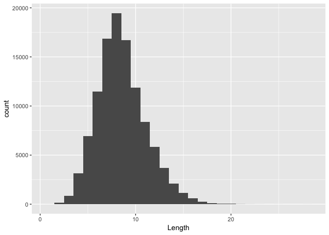

# distribution of english word length
Santiago David  
2017-11-07  

```r
library(tidyverse)
```

```
## Loading tidyverse: ggplot2
## Loading tidyverse: tibble
## Loading tidyverse: tidyr
## Loading tidyverse: readr
## Loading tidyverse: purrr
## Loading tidyverse: dplyr
```

```
## Conflicts with tidy packages ----------------------------------------------
```

```
## filter(): dplyr, stats
## lag():    dplyr, stats
```

```r
library(ggplot2)
library(readr)
```


```r
en <- read_tsv("words.en.length",
							 col_names = "Length")
```

```
## Parsed with column specification:
## cols(
##   Length = col_integer()
## )
```


```r
ggplot(en) + aes(x = Length) + geom_histogram(binwidth = 1)
```

<!-- -->

